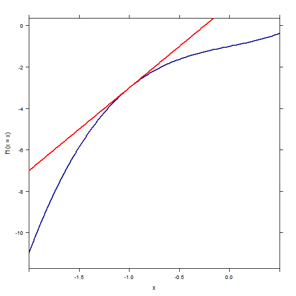
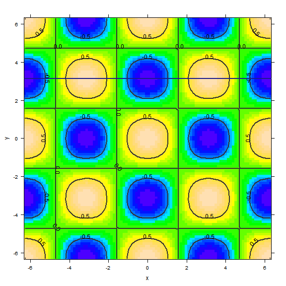
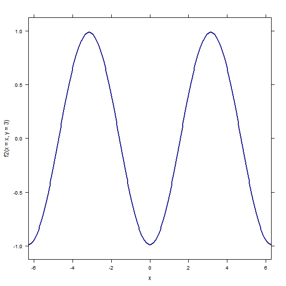

% Module 07:
  Slicing traces, tangent lines, and partial derivatives
% Math 275 Multivariable Calculus
% September 27, 2013 <!-- day 13 -->

$\newcommand{\R}{\mathbf{R}}$
$\newcommand{\dee}{\partial}$

The code below includes the R commands used to initialize this session.
Normally, they would be suppressed, but I include them for your inspection as
you play with R.


```r
require(knitr)
opts_chunk$set(fig.align = "center", fig.width = 8, fig.height = 8)
```


```r
library(mosaic)
trellis.par.set(theme = col.mosaic())
```


Read this module alongside sections 14.2 and 14.3 in Rogawski.

### Ordinary derivatives 

When we interpret an ordinary derivative geometrically, we usually have a picture in mind like this.


```r
f1 <- makeFun(x^3 + x - 1 ~ x)
plotFun(f1(x = x) ~ x, xlim = c(-2, 1/2), asp = 1)
f1prime <- D(f1(x) ~ x)
tangentline <- makeFun(slope * (x - x0) + f1(x0) ~ x, slope = f1prime(x = 0), 
    x0 = 0)
plotFun(tangentline(x = x, x0 = -1, slope = f1prime(x = -1)) ~ x, xlim = c(-2, 
    3/2), add = TRUE, col = "red")
```




If we depart from the point $(-1,-3)$ along the *tangent line* with horizontal displacement $\Delta x$, the corresponding vertical displacement is 
$$
    \Delta y = f_1'(-1)\Delta x = 4 \Delta x.
$$
This is nothing more than a paraphrase of the statement that the slope of the tangent line at the point $(-1, -3)$ is $4$. 

Because there is essentially only one "direction" in which to depart from $x = -1$, there is only one tangent line and only one associated slope or rate of change. This is not the case in dealing with functions of several variables.

### Slices by planes


```r
f2 <- makeFun(cos(x) * cos(y) ~ x & y)
plotFun(f2(x = x, y = y) ~ x & y, xlim = c(-2 * pi, 2 * pi), ylim = c(-2 * pi, 
    2 * pi), npts = 100)
plotFun(pi ~ x, add = TRUE)
```



In this contour plot of the function $f(x,y) = \cos{(x)} \cos{(y)}$, observe that the line $y = \pi$ is also plotted. Of course, $y = \pi$ describes a plane in $\R^3$: a plane parallel to the $(x,z)$-plane. By reading the contour plot from left to right along $y = \pi$, we can deduce information about the restricted (slice) function $f(x, \pi) = -\cos{(x)}$. 

For example, $f(x, \pi)$ has local maxima near $x = \pm 3$. Let us plot the slice $y = \pi$.


```r
plotFun(f2(x = x, y = 3) ~ x, xlim = c(-2 * pi, 2 * pi))
```




As we discussed in class, this curve should be pictured as living in the plane $y = \pi$. It is the intersection of that plane with the graph of $f(x,y)$.

### Partial derivatives

Each point $(x_0, y_0)$ in the domain of $f(x,y)$ corresponds to a point on the graph: the point $(x_0, y_0, f(x_0, y_0))$. There are two coordinate slicing planes associated with this point: the planes $x = x_0$ and $y = y_0$.

Each of those slicing planes intersects the graph of $f$ in a curve. The curve determined by the slice $x = x_0$ is the graph of the function $f(x_0,y)$, while that determined by the slice $y = y_0$ is evidently the graph of $f(x, y_0)$. 

Let us assume for now that both of these slice curves possess tangent lines. Unsurprisingly, not all functions have this property.

With this assumption in place, we define the partial derivatives of $f(x,y)$ by decreeing that
$$ \frac{\dee f}{\dee x}(x_0, y_0) $$
denotes the slope of the line tangent to the graph of $f(x, y_0)$ at $(x_0, y_0)$, and vice versa for the other partial derivative.

If you picture yourself standing on the graph at the point $(x_0, y_0, f(x_0, y_0))$, the landscape is steeper or shallower depending on which direction you face. Most likely, as you turn in place, you will be able to say in which direction the ascent is steepest (in both the positive and negative senses). The partial derivatives measure this steepness in the two special directions---the coordinate directions.

### Computation of partial derivatives

Partials are calculated by "fixing all but one variable" and differentiating as usual. I refer you to the text of 14.3 and the exercises for details. It is simple to calculate partial derivatives in R. For example:


```r
f2  # Text after the pound # is ignored by R; this line asks to print the definition of f2
```

```
## function (x, y) 
## cos(x) * cos(y)
```

```r
f2(x = 1, y = 1)  # Evaluate f2 at (1,1)
```

```
## [1] 0.2919
```

```r
D(f2(x = x, y = y) ~ x)  # partial of f2 w.r.t. x
```

```
## Warning: Implicit variables without default values (dangerous!): y
```

```
## function (x, y) 
## -(sin((x)) * cos((y)))
```

```r
D(f2 ~ y)  # partial of f2 w.r.t. y
```

```
## Warning: Implicit variables without default values (dangerous!): f2
```

```
## function (y, f2) 
## 0
```

```r
D(f2 ~ y)(x = 1, y = 1)  # Evaluate the partial at (1,1)
```

```
## Warning: Implicit variables without default values (dangerous!): f2
```

```
## Error: unused argument (x = 1)
```


R warns us on occasion that not all values are specified; this doesn't affect the validity of the displayed formulas for the indicated partial derivatives.

### Higher derivatives

It's probably no surprise that, just as in ordinary calculus, we can continue (or at least attempt to continue) to take partial derivatives. The second derivatives
$$ \frac{\dee^2 f}{\dee x^2}, \quad \frac{\dee^2 f}{\dee y^2} $$
give the expected information about concavity/acceleration in slice curves.

There is more, however: the *mixed* partial derivatives
$$ \frac{\dee^2 f}{\dee x \dee y}, \quad \frac{\dee^2 f}{\dee y \dee x}. $$
(Note that such expressions are always read right-to-left: the former is obtained by differentiating first with respect to $y$ and then $x$.)

Higher derivatives are also simple to calculate in R, as illustrated below


```r
D(y^2 * exp(x^2) ~ x & x)  # partial w.r.t. x, twice
```

```
## Warning: Implicit variables without default values (dangerous!): y
```

```
## function (x, y) 
## y^2 * (exp(x^2) * (2 * x) * (2 * x) + exp(x^2) * 2)
```

```r
D(y^2 * exp(x^2) ~ y & x)  # partial w.r.t. y first, then x
```

```
## function (y, x) 
## 2 * y * (exp(x^2) * (2 * x))
```

```r
D(y^2 * exp(x^2) ~ y & y)(x = 1, y = 1)  # Evaluate the partial at (1,1)
```

```
## Warning: Implicit variables without default values (dangerous!): x
```

```
## [1] 5.437
```


### A note on dimension

Many more interesting applications of calculus are possible in higher dimensions, because most natural phenomena are not inherently $1$-dimensional. Usually there are several parameters of interest. For example, a 1-dimensional problem about temperature is of limited use, because there are no 1-dimensional objects in physical reality. A very thin wire is approximated by a 1-dimensional mathematical ideal, but we can do better by allowing it the dimensions it occupies.

Alternatively, we might make use of additional dimensions to study a system *dynamically*, that is, as it evolves through time. The temperature in a very thin cylindrical metal rod might be described by a function $f(x,t)$, where $x$ gives a position along the rod and $t$ a time. This line of inquiry leads to the very important field of *partial differential equations*. The partial derivative $f_x$ tells how the temperature at a fixed time varies along the rod, while $f_t$ tells how the temperature at a fixed point changes as time passes. For ideal rods, these partials are related by the famous *heat equation*:

$$ \frac{\dee u}{\dee t} = \alpha \frac{\dee^2 u}{\dee x^2}. $$

The meaning of higher derivatives is most easily grasped through the consideration of such examples, in which the two "coordinate dimensions" (here, $x$ and $t$) are not really the same *dimension*: here, one is space and another, time.
