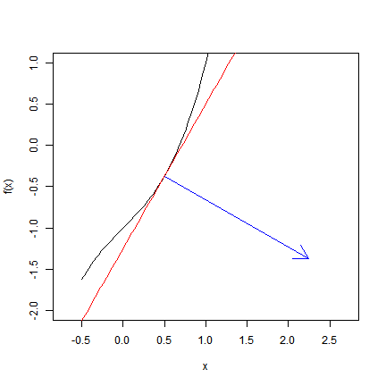

% Module 09:
  Level curves and surfaces
% Math 251 Calculus 3
% October 7, 2013

\newcommand{\angl}[1]{\langle #1 \rangle}
\newcommand{\norm}[1]{\lVert #1 \rVert}
\newcommand{\Angl}[1]{\left\langle #1 \right\rangle}
\newcommand{\Norm}[1]{\left\lVert #1 \right\rVert}

### What is a curve?

> What do we mean when we use the word "curve"?

If you pay attention, you'll notice we very often refer to an algebraic equation
using the word "curve". The identification can be very specific. Many people
readily identify $x^2$ as "a parabola". Is it? What is it, if not? Well, it is
an algebraic expression---in particular, a polynomial. Even the functional form
$f(x) = x^2$ is still perhaps not a parabola. It is an equation, associated via certain
long-standing conventions with a member of the curve-family "parabolas". 

The identification can also be very general. I am sure I have referred to a general equation such as $y = f(x)$ as a "curve" hundreds, if not thousands, of times.

Is that really what curves are? I think
most people would agree that a curve is a shape in the plane. When we engage in metonymy, using the word "curve" to refer to functions themselves rather than to their graphs, it is easy to forget how the graphs arise. 

### Solutions

When technical people talk about "solutions of an equation", they usually mean it in something other than the grade-school sense. To most people, "solving an equation" means something related to "isolating one variable". I would call this "solving *for*", and distinguish it from "solving". To *solve* an equation means to find all of its *solutions*, as explained below.

If we say "$(2,3)$ is a solution of the equation $y = f(x)$", what is meant is that $3 = f(2)$, and nothing more. In terms of curves, it means the point whose coordinates are $(2,3)$ is on the curve. Of course this is true: it is the definition of the graph of $f(x)$. When we have this kind of solution in mind, "solving the equation $f(x,y) = 0$" means finding some or all of the pairs $(x,y)$ that make the equation true. It doesn't typically mean "getting $y$ on one side", say. 

These ideas are associated for a good reason: "solving for $y$" is a great way of "solving an equation", because once it is done, you can *generate* many solutions very quickly, just by plugging in a ton of different $x$s and writing down the corresponding $y$s. If this cannot be done, finding solutions may be very difficult. 

It's important to remember that an equation like 
$$ y = (x-1)^2 + \frac{1}{4} $$
is neither true nor false without context. It lacks a truth value entirely. Only when an specific ordered pair of numbers $(x_0, y_0)$ is chosen to substitute in does the equation acquire truth or falsehood, and the pair is a solution of the equation, or not, accordingly.

Now we can begin the main discussion of this module: regarding graphs of functions as level curves or level surfaces.

### Promoting the graph of a single-variable function

Consider the graph of a (one-variable) function $f$: it is the collection of points whose coordinates satisfy the equation $y = f(x)$. Let us define a new, two-variable function $F$ by the variable $F(x,y) = f(x) - y$. Then, it is clear that the two equations $y = f(x)$ and $F(x,y) = 0$ are *equivalent*, meaning they have the same solutions:

> $(x,y)$ satisfies $y = f(x)$ iff it satisfies $f(x) - y = 0$
> iff it satisfies $F(x,y) = 0$.

Thus the graph of any function $f$ may also be thought of as a level curve. In the context of this module, it is hewlpful to use the capital and minuscule letters $F$ and $f$ to imply that the two functions are related in this way.

Observe that the gradient of $F$ is the vector $\angl{f'(x), -1}$. You showed in [Workshop 05][w05] that this vector is orthogonal to the line tangent to the graph of $f$ at $x$.


```r
f <- function(x) {
    x^3 + x - 1
}
fp <- function(x) {
    3 * x^2 + 1
}
curve(f(x), xlim = c(-0.5, 2.5), ylim = c(-2, 1), asp = 1)
curve(f(x = 0.5) + fp(0.5) * (x - 0.5), col = "red", add = TRUE)
arrows(0.5, f(x = 0.5), fp(0.5) + 0.5, -1 + f(x = 0.5), col = "blue")
```




In this R code I use the option `asp = 1` when building the first plot to ensure that the scales on the two axes are the same, so that the blue gradient vector looks as orthogonal to the red tangent line as it really is. Again, you showed in Workshop 05 that the vector $\angl{f'(x), -1}$ is always perpendicular to the tangent lines to the graph of $f$. Rephrased in terms of $F$, we would say that 

> $\nabla F = \Angl{\frac{\partial F}{\partial x}, \frac{\partial F}{\partial y}}$ is orthogonal to the curve $F(x,y) = 0$. 

Interestingly, more is true: $\nabla F$ is orthogonal to all the level curves of $F(x,y)$. It is not a coincidence that the gradient vectors are perpendicular to the level curves: it is the general state of affairs, for *differentiable* functions. (Remember from 14.4 that merely having partial derivatives does not suffice to qualify a function as differentiable.)

The orthogonality of gradients with level curves is proved in section 14.5, but the proof relies on the notion of *parametrizing* a curve from chapters 11 and 13, which we have not yet discussed. In the next section, we move up a dimension.

### Graphs of two-variable functions as level surfaces

Now let us consider a function $f(x,y)$. It gives rise to a surface by considering its graph to be the set of points $x,y,f(x,y)$, or what is the same thing, the set of solutions of the equation
$$ z = f(x,y). $$
Now introduce the three-variable function $F(x,y,z) = f(x,y) - z$, and regard the graph of $f$ as the solutions of the equation $F(x,y,z) = 0$. 

There is a little bit of mental gymnastics involved in keeping $f$ and $F$ distinct, because they are both of great geometric utility in thinking about the surface they have in common: the graph of $f$, which is the same thing as the zero level surface of the function $F$.

On the one hand, we may consider the gradient of $f$, which is the vector
$$ \nabla f = \Angl{\frac{\partial f}{\partial x},\frac{\partial f}{\partial y}}.$$ This vector is helpful in visualizing the contour map of $f$, because it is everywhere perpendicular to the contours and points in the direction of quickest increase.

> $\nabla f$ is perpendicular to the contours of $f$, because those contours are exactly the level curves of $f$.

On the other, we might consider the gradient of $F$, the vector
$$ \nabla F = \Angl{\frac{\partial f}{\partial x},\frac{\partial f}{\partial y}, -1}.$$
We saw last week that this vector is a normal vector for the tangent planes to the graph of $f$. Indeed, such a plane (at, say, $(a, b, f(a,b))$) has an equation of the form
$$ 0 = f(a,b) + f_x(a,b)(x - a) + f_y(a,b)(y - b) + (-1)(z - f(a,b))$$.
Evidently, the normal vector coincides with $\nabla F$.

### Functions of three variables

If we begin with a function of three variables $f(x,y,z)$, our only chance is to visualize this function's level surfaces, assisted by its gradient
$$ \nabla f = \Angl{\frac{\partial f}{\partial x}, \frac{\partial f}{\partial y}, \frac{\partial f}{\partial z}}. $$

Abstractly, the notion of an associated function $F(x,y,z,w) = f(x,y,z) - w$ is perfectly legitimate. Its zero level surface is the graph of $f$, just as above. Of course we can picture neither of these 3-dimensional hypersurfaces in 4-dimensional space. But if we could picture it, we would see that its tangent space (again, 3-dimensional) would be orthogonal to the 4-dimensional gradient vector $\nabla F = \angl{\partial f/\partial x, \partial f/\partial y, \partial f/\partial z, -1}$.
            
[w05]: ../../workshops/05/Workshop.pdf
